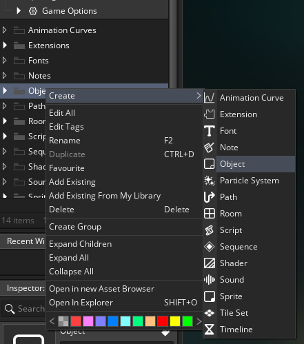
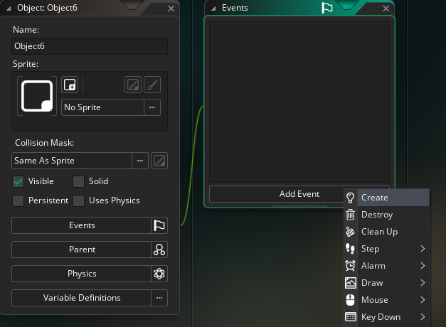

## Hello World Tutorial!

In this tutorial we'll learn how to display messages to the console output in Gamemaker.

## show_debug_message

This built-in function allows us to display messages in the console, which is very useful for debugging.

## Instructions
The very first thing we want to do is to create a new object in the asset browser.


Then add a create event to the new object.


Usually the first thing most people do when learning a new language is to learn how to output "Hello World", and this is what we'll be aiming to do here. So in the create event of the object, simply write:

```gml
show_debug_message("Hello World!");
```

If you then place the object in the room, and run the project, the console will show ""Hello World!" after compiling. 

Congratulations, you have just written your first bit of functional code in Gamemaker!